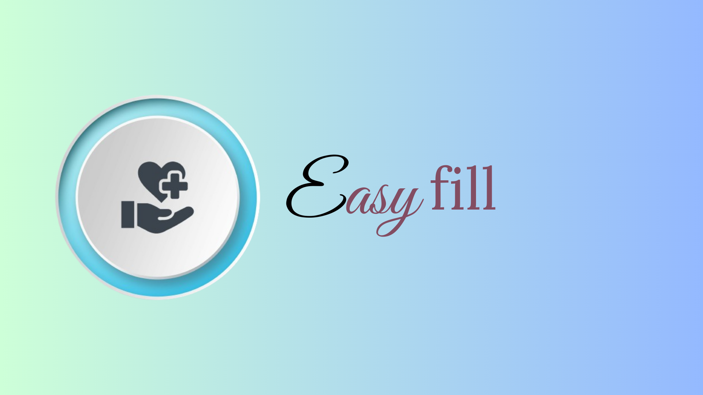

  

  

  <strong>Easyfill

#
## Table of Contents
- [📚Introduction](#introduction) 
- [✨Features](#features) 
- [✒Getting Started](#getting-started) 
  - [🔨Prerequisites](#prerequisites) 
  - [⚙Installation](#installation) 
  - [💻System Preview](#system-preview) 
- [🌏Sustainable Development Goals (SDGs)](#sustainable-development-goals-sdgs)
- [🎥 Video Presentation](#video-presentation)
- [🤵Meet the Team](#meet-the-team)
- [📊Contributions and Self-Assessment ](#contributions-and-self-assessment)

 #
## 📚Introduction 

Everyday a lot of people are going to health care facilities to have a consultation and cure in their illness or concerns to their health. As they go their, they are required to fill out a form manually which takes a lot of time and can be a source of illness so I come up with Easyfill. Easyfill is a system that makes patients fill out a form easily from a health care organizations.

#
## ✨Features

- Show Patient Information
- Insert, update and delete information

#
## ✒Getting Started

### 🔨Prerequisites

To start, you need to download the following on the system

- **Python**

Python version 3.12

- **pip**

The version of pip used was the latest which is 23.3.1

- **mysqlconnector**

The version of mysql-connector used was 8.2.0. The project take user input which is saved in mysql.

#
### ⚙Installation

#### 1. Download python. Install it after.
Download it in the https://www.python.org/

#### 1. Download vscode. Install it after.
Download it in the https://code.visualstudio.com/download

#### 5. Open vscode and open terminal.
You can see it at the bottom part of it.

#### 6. From there, type “pip install pip” If you do not have pip installed.

To install the other packages follow the same syntax but change the package name at the end

- **pip install mysql-connector-python**
- **pip install Pillow**

#
### 💻System Preview
#

  

#
## 🌏Sustainable Development Goals (SDGs)

Easyfill aligns with sdg 3 that promotes healthy and safe filling out of information

#
## 🎥Video Presentation

  Watch the video presentation to learn more about the Eastfill system.

 

#
## 🤵Meet me

  

 Golosino Jericho

  22-05441@g.batstate-u.edu.ph

## 📊Contributions and Self-Assessment

  <strong>Breakdown of Contributions</strong>

- **Golosino Jericho:** Programmer, PPT Presentation, Video Presentation, ReadMe(Documentation - (100%)

  <strong>Self-Assessment</strong>

  I, the Easyfill creator, have conducted a self-assessment of my project based on various criteria. Here are the ratings for the criteria:

- **Code Reusability:** 4
- **Maintainability:** 4
- **Scalability:** 4
- **Execution:** 4
- **Originality:** 3
- **Overall Impression:** 3

 These ratings signify my assessment of the project's performance in specific domains. I am committed to ongoing improvement and value your suggestions for potential enhancements in the future.

